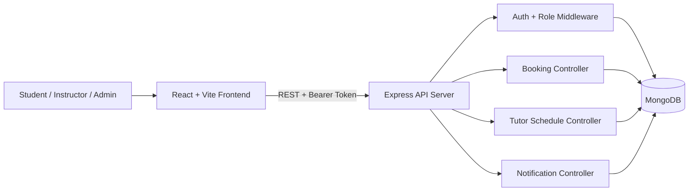

<div align="center">

# Tutor Support System at Ho Chi Minh City University of Technology – VNU-HCM

_Empowering Growth Through Structured Mentorship Connections_


Built with the tools and technologies:


</div>


Tutor-Mentee-Program-System is a full-stack web platform that connects students with tutors for scheduling, booking, and managing mentorship sessions. It solves fragmented mentoring workflows by centralizing authentication, tutor availability, booking lifecycle, and session tracking in one system. The primary users are students, instructors, and administrators in an academic support environment.

## Visuals / Demo

> Recommended: replace the placeholder image below with a real high-resolution screenshot from your running UI.


## Table of Contents

- [Features](#features)
- [Role Capability Matrix](#role-capability-matrix)
- [Project Structure](#project-structure)
- [Prerequisites](#prerequisites)
- [Installation](#installation)
- [Usage / Quick Start](#usage--quick-start)
- [API Surface](#api-surface)
- [Architecture \& System Design](#architecture--system-design)
- [Deployment](#deployment)
- [Testing](#testing)
- [Configuration / Environment Variables](#configuration--environment-variables)
- [Contributing](#contributing)
- [License](#license)

## Features

- Role-based flows for `student`, `instructor`, and `admin` users.
- JWT authentication with refresh token rotation and account lock policy.
- Tutor schedule management (create/update/delete availability by date + time slots).
- Student booking lifecycle (book, cancel, change) with business rules (minimum 3-hour lead time).
- Notification endpoints for unread count and mark-as-read actions.
- Automated backend testing for integration and performance scenarios.

## Role Capability Matrix

| Capability | Student | Instructor | Admin |
|---|---|---|---|
| Register / login | Yes | Yes | Yes |
| Manage own profile | Yes | Yes | Yes |
| Browse available tutors | Yes | Limited | Optional |
| Book / cancel / change sessions | Yes | No | Optional |
| Create and manage tutor schedules | No | Yes | Optional |
| View enrolled students per session | No | Yes | Optional |
| Manage system-wide users and policies | No | No | Yes |

## Project Structure

```text
Tutor-Mentee-Program-System/
|- backend/
|  |- config/
|  |- controllers/
|  |- middlewares/
|  |- models/
|  |- routes/
|  |- tests/
|  |- seeds/
|  `- server.js
|- frontend/
|  |- src/
|  |  |- components/
|  |  |- pages/
|  |  `- styles/
|  `- vite.config.js
`- README.md
```

## Prerequisites

- Node.js `>= 20.x`
- npm `>= 9.x`
- MongoDB `>= 6.x` (local or remote)
- Git (for cloning and contribution workflow)

## Installation

### 1) Clone repository

```bash
git clone <your-repository-url>
cd Tutor-Mentee-Program-System
```

### 2) Install dependencies

```bash
cd backend
npm install
cd ../frontend
npm install
cd ..
```

### 3) Configure environment files

```bash
copy backend\.env.example backend\.env
copy frontend\.env.example frontend\.env
```

If you are using Git Bash or WSL instead of PowerShell:

```bash
cp backend/.env.example backend/.env
cp frontend/.env.example frontend/.env
```

### 4) Start backend

```bash
cd backend
npm run dev
```

Backend default URL: `http://localhost:5000`

### 5) Start frontend (new terminal)

```bash
cd frontend
npm run dev
```

Frontend default URL: `http://localhost:5173`

## Usage / Quick Start

### Web app flow

1. Open `http://localhost:5173`
2. Register or login
3. Student can browse tutor availability and book sessions
4. Instructor can publish available slots and manage enrolled students

### API quick test (login)

```bash
curl -X POST http://localhost:5000/api/auth/login \
  -H "Content-Type: application/json" \
  -d "{\"email\":\"student@test.com\",\"password\":\"123456\"}"
```

Expected JSON response format:

```json
{
  "success": true,
  "message": "Login successful",
  "token": "<access-token>",
  "refreshToken": "<refresh-token>",
  "user": {
    "_id": "65f...",
    "username": "student",
    "email": "student@test.com",
    "role": "student",
    "fullName": "Student Test",
    "avatar": null
  }
}
```

### Common backend scripts

```bash
cd backend
npm run dev
npm run seed
npm run seed:all
npm test
npm run test:coverage
```

### Common frontend scripts

```bash
cd frontend
npm run dev
npm run build
npm run lint
```

## API Surface

Base URL: `http://localhost:5000/api`

| Module | Base path | Purpose |
|---|---|---|
| Auth | `/auth` | Register, login, token refresh, profile endpoints |
| Tutor | `/tutors` | Tutor profile, subjects, classes, bookings, enrolled students |
| Schedule | `/schedules` | Tutor availability CRUD and student-facing tutor availability discovery |
| Booking | `/bookings` | Book/cancel/change/list booking flows |
| Notification | `/notifications` | Notification list, unread count, mark as read |
| Admin | `/admin` | Admin-protected endpoints (scaffolded) |
| Student | `/students` | Student-protected endpoints (scaffolded) |
| Class | `/classes` | Class endpoints (scaffolded) |
| Subject | `/subjects` | Subject endpoints (scaffolded) |
| Library | `/library` | Library endpoints (scaffolded) |

### High-frequency endpoints

| Method | Endpoint | Description |
|---|---|---|
| `POST` | `/api/auth/register` | Create account |
| `POST` | `/api/auth/login` | Authenticate user |
| `GET` | `/api/tutors/teaching-subjects` | Get instructor teaching subjects |
| `POST` | `/api/schedules` | Create/update tutor schedules |
| `GET` | `/api/schedules/available-tutors` | List tutors with available schedules |
| `GET` | `/api/schedules/tutor/:tutorId` | List a tutor's available slots |
| `POST` | `/api/bookings/book-tutor-schedule` | Book a schedule slot |
| `POST` | `/api/bookings/cancel` | Cancel booked slot |
| `POST` | `/api/bookings/change` | Change booked slot |
| `GET` | `/api/bookings/list` | List current user's bookings |

## Architecture & System Design

### Tech stack

- Frontend: `React 19`, `Vite`, `React Router`, `react-calendar`
- Backend: `Node.js`, `Express`, `Mongoose`
- Database: `MongoDB`
- Auth/Security: `JWT`, `bcryptjs`, `helmet`, `cors`, `cookie-parser`
- Testing: `Jest`, `Supertest`, `Artillery`

### System diagram



### Engineering trade-offs

- The system stores tutor availability by date/time slot to simplify booking logic and UI rendering; trade-off: more custom validation logic for slot conflicts.
- JWT + refresh tokens improve stateless API scalability; trade-off: token lifecycle handling (rotation/revocation) adds backend complexity.
- Business constraints (minimum 3-hour lead time for booking/cancel/change) protect tutor scheduling quality; trade-off: reduced short-notice flexibility for students.
- Lean Mongoose queries and route-level limits improve performance under load; trade-off: extra data transformation code in controllers.

## Deployment

### Production build flow

```bash
cd frontend
npm run build
cd ../backend
npm install --omit=dev
NODE_ENV=production npm start
```

### Recommended deployment topology

- Deploy frontend static build to `Vercel`, `Netlify`, or `Nginx`.
- Deploy backend API to `Render`, `Railway`, `Fly.io`, or a VPS with `PM2`.
- Use managed MongoDB (`MongoDB Atlas`) for production reliability.
- Set strict production secrets in environment variables, never in source code.

### Minimum production checklist

- Set strong `JWT_SECRET` and `REFRESH_TOKEN_SECRET`.
- Set `FRONTEND_URL` to your real frontend domain.
- Disable auto seeding by setting `SEED_ON_START=false`.
- Enable HTTPS termination at the edge or reverse proxy.
- Add a root `LICENSE` file if this is a public repository.

## Testing

### Frameworks

- `Jest` for unit/integration test execution
- `Supertest` for API assertions
- `Artillery` for load/performance scenarios

### Run tests

```bash
cd backend
npm test
npm run test:integration
npm run test:coverage
```

### Performance suites

```bash
cd backend
npm test -- --testPathPattern=performance
```

## Configuration / Environment Variables

Security note: never commit real secrets. Use `.env.example` templates and keep actual values in local `.env` files only.

### Backend (`backend/.env`)

| Variable Name | Type | Default Value | Description |
|---|---|---|---|
| `NODE_ENV` | string | `development` | Runtime environment (`development`, `test`, `production`). |
| `PORT` | number | `5000` | Backend server port. |
| `MONGO_URI` | string | `mongodb://127.0.0.1:27017/cnpm_tutor_db` | MongoDB connection string. |
| `FRONTEND_URL` | string | `http://localhost:5173` | Allowed frontend origin for CORS. |
| `SEED_ON_START` | boolean | `true` (in development) | Auto-seed user/class data when server starts. |
| `JWT_SECRET` | string | `change-me` | Secret for access token signing. |
| `JWT_EXPIRES_IN` | string | `24h` | Access token expiration. |
| `REFRESH_TOKEN_SECRET` | string | `change-me` | Secret for refresh token signing. |
| `REFRESH_TOKEN_EXPIRES_IN` | string | `7d` | Refresh token expiration. |
| `APP_NAME` | string | `CNPM-Tutor-System` | JWT issuer/application label. |
| `BCRYPT_SALT_ROUNDS` | number | `10` | Password hash rounds. |
| `SESSION_TIMEOUT` | number | `86400000` | Session timeout in milliseconds. |
| `MAX_LOGIN_ATTEMPTS` | number | `5` | Failed login attempts before temporary lock. |
| `LOCK_TIME` | number | `30` | Account lock duration in minutes. |
| `ALLOW_MULTIPLE_DEVICES` | boolean | `true` | Allow multiple refresh tokens/devices. |
| `REQUIRE_EMAIL_VERIFICATION` | boolean | `false` | Require email verification before login. |
| `ALLOWED_EMAIL_DOMAINS` | string | `hcmut.edu.vn,gmail.com` | Allowed email domains for registration. |
| `GOOGLE_CLIENT_ID` | string | empty | Optional Google OAuth client ID. |
| `GOOGLE_CLIENT_SECRET` | string | empty | Optional Google OAuth client secret. |
| `GOOGLE_CALLBACK_URL` | string | `/api/auth/google/callback` | Optional Google callback URL. |
| `FACEBOOK_CLIENT_ID` | string | empty | Optional Facebook OAuth client ID. |
| `FACEBOOK_CLIENT_SECRET` | string | empty | Optional Facebook OAuth client secret. |
| `FACEBOOK_CALLBACK_URL` | string | `/api/auth/facebook/callback` | Optional Facebook callback URL. |

### Frontend (`frontend/.env`)

| Variable Name | Type | Default Value | Description |
|---|---|---|---|
| `VITE_API_URL` | string | `http://localhost:5000/api` | Base URL for frontend API requests. |

## Contributing

1. Create a feature branch from `main` (example: `feature/booking-ui-fix`).
2. Keep commits small and descriptive.
3. Run backend tests and frontend lint before opening a PR.
4. Open a Pull Request with clear scope, testing evidence, and screenshots for UI changes.

## License

This repository currently uses the `ISC` license (as declared in `backend/package.json`).

For open-source distribution, add a root `LICENSE` file and update this section to link it directly.